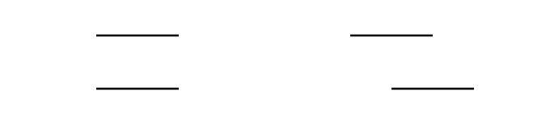

# Perceptual differences in Müller-Lyer illusion variations

## Background

The Müller-Lyer illusion was first described by Franz Carl Müller-Lyer in 1889 [[1]](#ref-contributions-of-muller-lyer). The visual illusion consists of two lines of equal length, one with arrowheads pointing inwards and the other with arrowheads pointing outwards. The line with the arrowheads pointing outwards appears longer than the line with the arrowheads pointing inwards. Research into the illusion suggests that the perceptual difference between the two lines is due to the brain's probabilistic interpretation of the visual information [[2]](#ref-explained-by-stats), which indicates that the brain utilizes patterns and statistics from the real world to make sense of what is perceived.

The Müller-Lyer illusion has been studied extensively in psychology and neuroscience, but the perceptual differences between variations of the illusion have not been well documented. This study aims to investigate the perceptual differences between variations on the classic Müller-Lyer figure.

  
  
    Figure 1. Classic demonstration of the Müller-Lyer illusion. While the two lines are of equal length, the line with the arrowheads pointing outwards appears to be longer than the line with the arrowheads pointing inwards.
  

One common variation of the Müller-Lyer illusion was first described by Franz Brentano in 1892. It was proposed along with an explanation of the illusion based on "an overestimation of small [angles] and an underestimation of large angles" [[3]](#ref-brentano). The Brentano variation consists of a single line that is divided by oblique lines—a horizontally stacked version of the classic figure. This study will investigate the perceptual differences between the classic Müller-Lyer figure and the Brentano variation, as well as the classic figure with a horizontal offset.

The aim of quantifying the perceptual differences between these variations is to determine the extent to which the illusion is influenced by the distracting elements in the figure. Howe and Purves (2005) remark that although variations of the Müller-Lyer illusion have been studied, they have not been quantitatively compared [[4]](#ref-howe). This study will address this gap in the literature by quantifying the perceptual differences between variations of the Müller-Lyer illusion.

## Methods

Using the classic Müller-Lyer figure as a base, multiple variations were created by changing the position of the lines and by replacing the arrowheads with alternative shapes. Participants were shown a figure with lines of randomized lengths and asked to select one of the following:

- the left/top line is definitely longer,
- the left/top line is slightly longer,
- the lines are the same length,
- the right/bottom line is slightly longer,
- or the right/bottom line is definitely longer.

A web-based survey was created to present the figures to participants and collect their responses. The survey was completed by 32 participants. Demographic information, such as age and eye color, was also collected to investigate potential correlations between demographic factors and perceptual differences.

Figures 2-4 show the variations of the Müller-Lyer illusion used in the survey. The variations in each figure are denoted as follows:

- top-left: arrowhead variation,
- top-right: circle variation,
- bottom-left: obliques variation,
- bottom-right: square variation.

<table>
  <tr>
    <td>
      

        
        
          Figure 2. Sample figures used in the survey in a vertical configuration.
        
      

    </td>
    <td>
      

        
        
          Figure 3. Sample figures used in the survey in the Brentano configuration.
        
      

    </td>
  </tr>
  <tr>
    <td>
      

        
        
          Figure 4. Sample figures used in the survey in an offset configuration.
        
      

    </td>
    <td>
      

        
        
          Figure 5. Sample baseline figures used in the survey in both vertical and offset configurations.
        
      

    </td>
  </tr>
</table>

A baseline figure was also included in the survey to determine the accuracy of the responses. The baseline figure consisted of two lines with no arrowheads or other distracting elements. The baseline figure was presented in both vertical and offset configurations, as shown in Figure 5. The baseline figure was not presented in the Brentano configuration, as without any additional elements it would not be possible to segment the line into two parts.

For each participant, five trials for each configuration-variation pair were conducted, for a total of 70 trials per participant. The ordering of the trials was not randomized to prevent confusion between the different variations. Before each type of figure was presented, a sample figure was shown to the participant to ensure they understood the task and the figure variations.

For each response, the participant's selection was recorded as well as the time taken to make the selection. The time taken to make the selection was used to determine if participants spent more time on certain configurations or variations.

In analyzing the data, the perceived delta between the two lines was calculated for each response according to the following heuristic:

- left/top definitely longer: -3 mm,
- left/top slightly longer: -1 mm,
- same length: 0 mm,
- right/bottom slightly longer: +1 mm,
- right/bottom definitely longer: +3 mm.

The perceptual bias was calculated by subtracting the actual delta between the two lines from the perceived delta.

## Results

### Effect of eye color

  
  
    Figure 6. The distribution of perceptual bias by eye color. Statistical significance was found between blue and hazel (p = 0.00011) and blue and green (p = 0.00016). The other comparisons were not statistically significant (p > 0.05).
  

## Discussion

## Conclusion

## References

1.  Day, R. H., & Knuth, H. (1981). The Contributions of F C Müller-Lyer. Perception, 10(2), 126-146. https://doi.org/10.1068/p100126
2.  Howe, Catherine Q., and Dale Purves. “The Müller-Lyer Illusion Explained by the Statistics of Image-Source Relationships.” Proceedings of the National Academy of Sciences of the United States of America, vol. 102, no. 4, 2005, pp. 1234–39. JSTOR, http://www.jstor.org/stable/3374407. Accessed 29 Nov. 2024.
3.  “PERIODICALS.” The Monist, vol. 3, no. 4, 1893, pp. 651–58. JSTOR, http://www.jstor.org/stable/27897111. Accessed 29 Nov. 2024.
4. Howe, Catherine Q., and Dale Purves. “The Müller-Lyer Illusion Explained by the Statistics of Image-Source Relationships.” Proceedings of the National Academy of Sciences of the United States of America, vol. 102, no. 4, 2005, pp. 1234–39. JSTOR, http://www.jstor.org/stable/3374407. Accessed 29 Nov. 2024.
