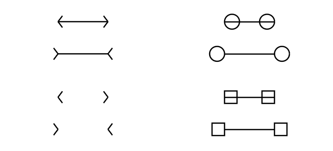
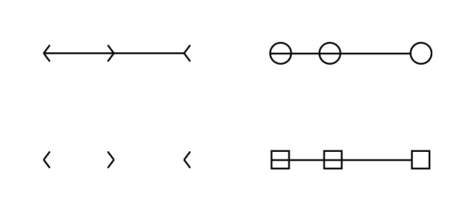
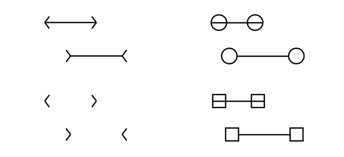

# Perceptual differences in Müller-Lyer illusion variations

## Abstract

TODO or remove?

## Background

The Müller-Lyer illusion was first described by Franz Carl Müller-Lyer in 1889 [[1]](#ref-contributions-of-muller-lyer). The visual illusion consists of two lines of equal length, one with arrowheads pointing inwards and the other with arrowheads pointing outwards. The line with the arrowheads pointing outwards appears longer than the line with the arrowheads pointing inwards. Research into the illusion suggests that the perceptual difference between the two lines is due to the brain's probabilistic interpretation of the visual information. The illusion is thought to be caused by the brain's use of patterns and statistics from the real world to make sense of what we see [[2]](#ref-explained-by-stats).

The Müller-Lyer illusion has been studied extensively in psychology and neuroscience, but the perceptual differences between variations of the illusion have not been well studied. This study aims to investigate the perceptual differences between variations on the classic Müller-Lyer figure.

  
  
    Figure 1. Classic demonstration of the Müller-Lyer illusion.
  

## Methods

Using the classic Müller-Lyer figure as a base, multiple variations were created by changing the positioning of the lines and replacing the arrowheads with alternative shapes. Participants were shown a figure with lines of randomized lengths and asked to select one of the following:

- the left/top line is definitely longer,
- the left/top line is slightly longer,
- the lines are the same length,
- the right/bottom line is slightly longer,
- or the right/bottom line is definitely longer.

A web-based survey was created to present the figures to participants and collect their responses. The survey was completed by 32 participants. Demographic information, such as age and eye color, was also collected to investigate potential correlations between demographic factors and perceptual differences.

  
  
    Figure 2. Sample figures used in the survey in a vertical configuration.
  

  
  
    Figure 3. Sample figures used in the survey in the Brentano configuration.
  

  
  
    Figure 4. Sample figures used in the survey in an offset configuration.
  

## Results

## Discussion

## Conclusion

## References

1.  Day, R. H., & Knuth, H. (1981). The Contributions of F C Müller-Lyer. Perception, 10(2), 126-146. https://doi.org/10.1068/p100126
2.  Howe, Catherine Q., and Dale Purves. “The Müller-Lyer Illusion Explained by the Statistics of Image-Source Relationships.” Proceedings of the National Academy of Sciences of the United States of America, vol. 102, no. 4, 2005, pp. 1234–39. JSTOR, http://www.jstor.org/stable/3374407. Accessed 29 Nov. 2024.
